# Arch Linux Installation with LUKS Encryption, LVM, and systemd-boot

## Overview

This guide details the step-by-step installation of Arch Linux on a clean NVMe disk, secured with full disk encryption (LUKS), flexible partition management via LVM, and booting through systemd-boot. This setup forms a robust foundation for a secure, headless Kubernetes home lab environment.

A crucial note addresses adding the `nomodeset` kernel parameter to resolve graphics compatibility issues on certain hardware.

We adhere to industry best practices starting with verifying ISO integrity and authenticity using GPG keys to ensure a trusted installation medium.

---

## 1. Verifying the Arch ISO

Before proceeding, verify the Arch Linux ISO for integrity and authenticity:

1. Download the ISO from an official Arch Linux mirror.
2. Download the matching `.sig` signature file.
3. Import the Arch Linux master signing key:

```bash
gpg --auto-key-locate clear,wkd -v --locate-external-key <KEY_ID>
```

4. Verify the ISO:

```bash
gpg --verify archlinux-2025.08.01-x86_64.iso.sig archlinux-x86_64.iso
```

A successful verification confirms the signature is valid and signed by a trusted Arch developer.

---


---

✅ *With verification complete, you can proceed confidently knowing your media is authentic and untampered.*

---

## 2. Creating a Bootable USB with Rufus

On Windows, I used **Rufus** to flash the Arch Linux ISO onto a USB drive, which formats and prepares it for booting.

> **Note:** Select GPT partition scheme for UEFI during flashing for compatibility.

---

## 3. Handling Graphics Issues with `nomodeset`

Some hardware may cause black screens on boot. Temporarily add `nomodeset` as a kernel parameter at boot to disable kernel mode setting, allowing basic graphics until drivers are installed.

---

## 4. BIOS/UEFI Configuration to Boot from USB

1. Enter BIOS/UEFI setup (usually via `F2`, `F12`, `Del`, or `Esc` at startup).
2. Set USB flash drive as primary boot device.
3. Disable Secure Boot to allow booting unsigned OS images.
4. Save and exit.

> **Note:** Arch Linux’s bootloader is unsigned by default, so Secure Boot must be disabled.

---

## 5. Boot into Arch ISO

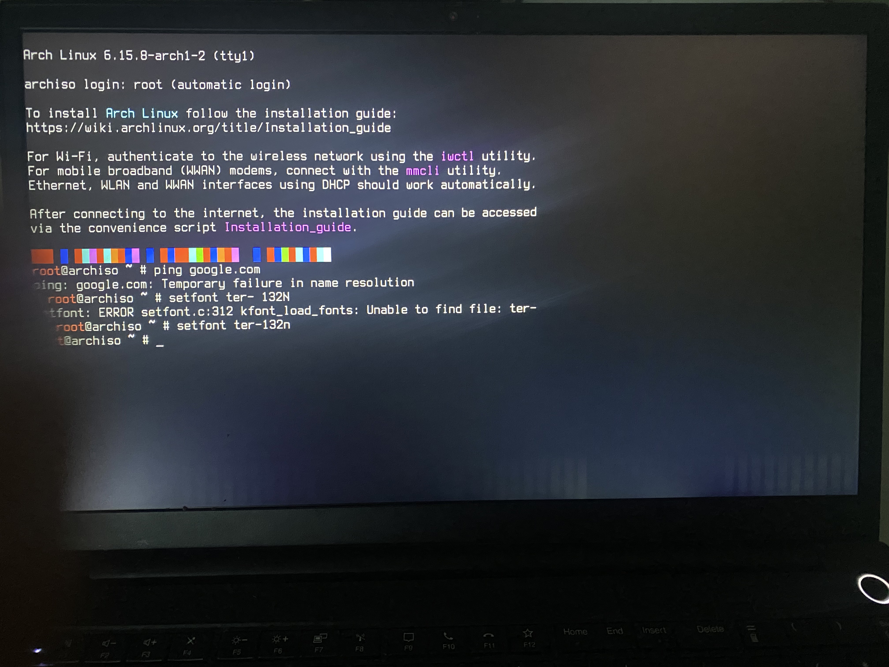

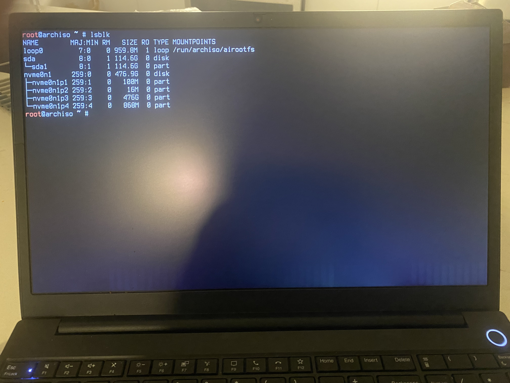

---

## 6. Wiping Disk with `sgdisk --zap-all`

Run:

```bash
sudo sgdisk --zap-all /dev/nvme0n1
```

This removes existing partition tables and metadata, ensuring a clean disk.

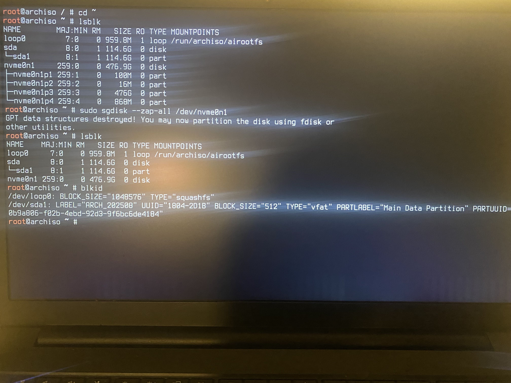

---

## 7. Disk Partitioning with fdisk

Create three partitions:

- EFI System Partition (1 GiB), type code EFI System (`ef00`).
- BIOS Boot Partition (1 MiB), type code BIOS boot (`ef02`).
- Linux LVM Partition (remaining space), type code Linux LVM (`8e00`).

This layout supports both UEFI and BIOS boot modes and prepares LVM for encryption and logical volume creation.

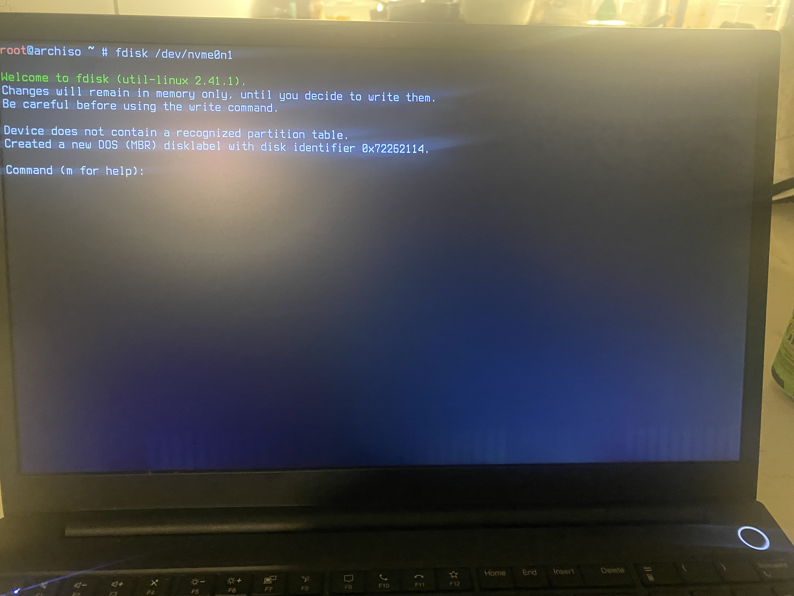  
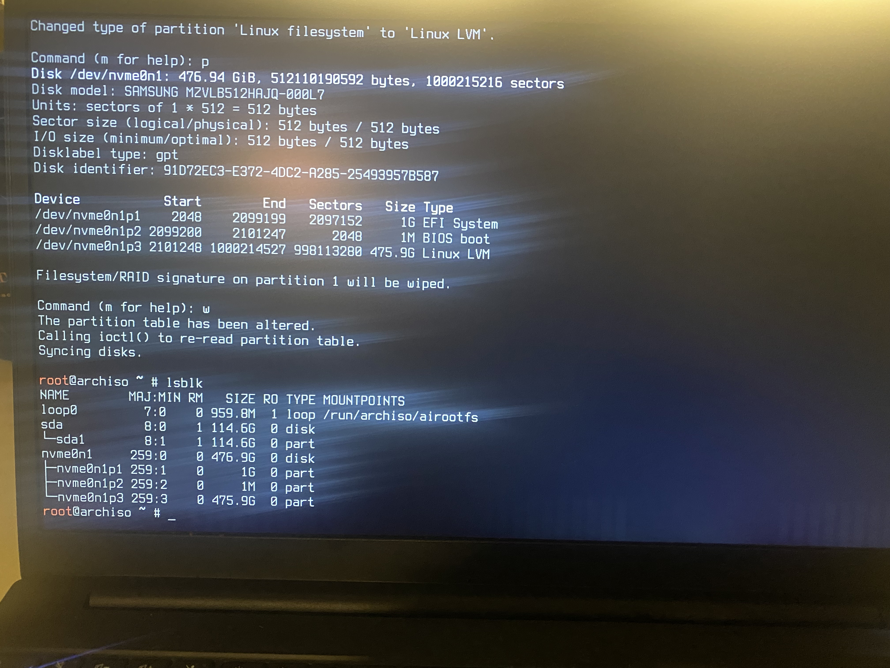

---

## 8. Encrypting LVM Partition with LUKS

Initialize encryption:

```bash
cryptsetup luksFormat /dev/nvme0n1p3
cryptsetup open /dev/nvme0n1p3 cryptlvm
```

Create volume group inside encrypted container:

```bash
vgcreate oluwa /dev/mapper/cryptlvm
```

> **Note:** LVM enables dynamic resizing and flexible storage management, while LUKS ensures full-disk encryption, protecting data at rest against unauthorized access.

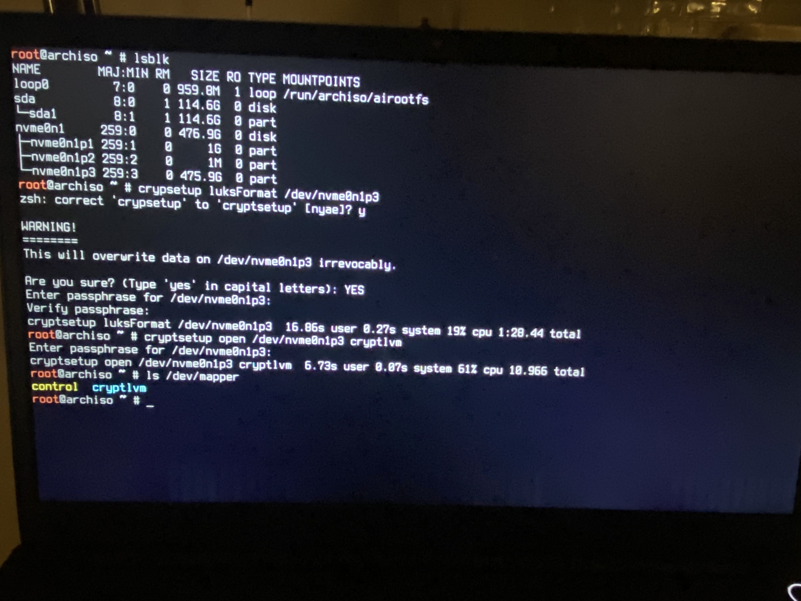

---

## 9. Creating Logical Volumes

```bash
lvcreate -L 8G oluwa -n swap
lvcreate -L 32G oluwa -n root
lvcreate -l 100%FREE oluwa -n home
```

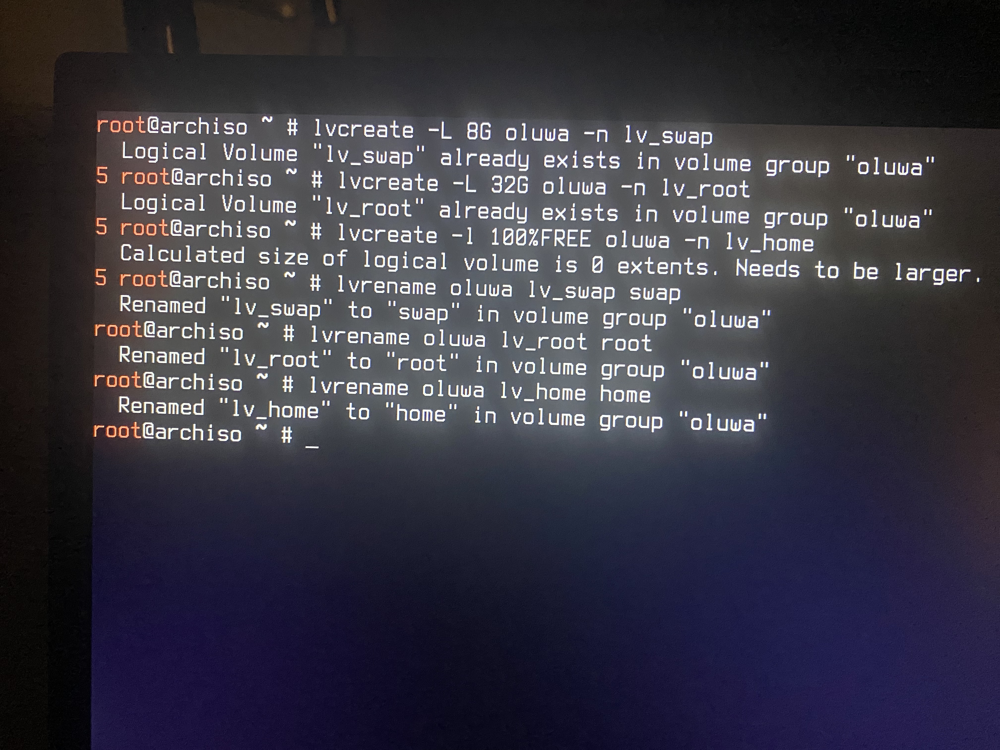

---

## 10. Formatting and Mounting

- Format EFI as FAT32.
- Format root and home as ext4.
- Setup swap.
- Mount root at `/mnt`.
- Mount EFI at `/mnt/boot`.
- Activate swap.

> **Important:** Mount the root partition first; other mounts depend on this hierarchy.

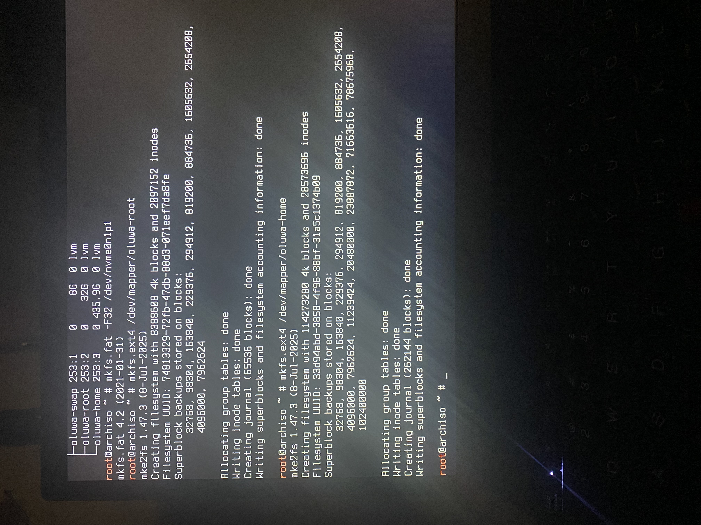  
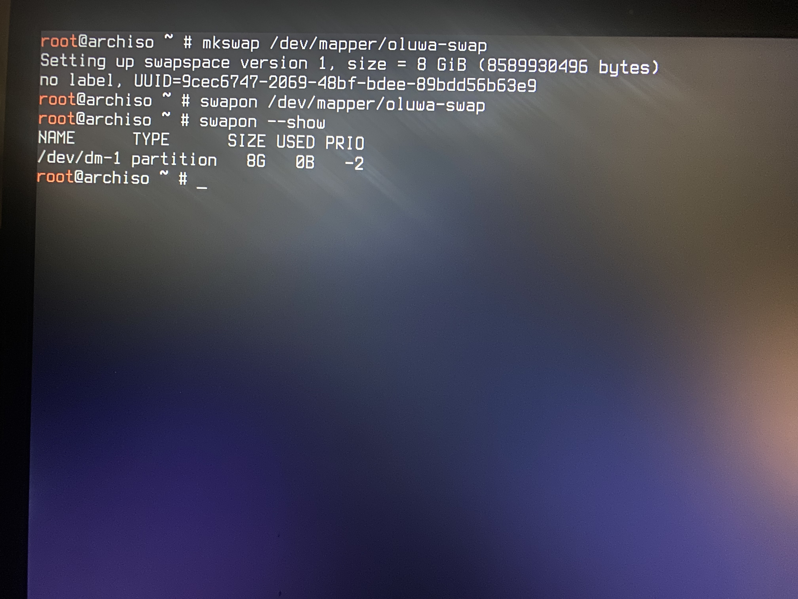  
  


---

## 11. Installing Base System and Generating fstab

```bash
pacstrap /mnt base linux linux-firmware lvm2 systemd-boot
genfstab -U /mnt >> /mnt/etc/fstab
```


---

## 12. System Configuration in chroot

- Set timezone, locales, hostname.
- Configure root password.
- Setup networking via systemd-networkd.

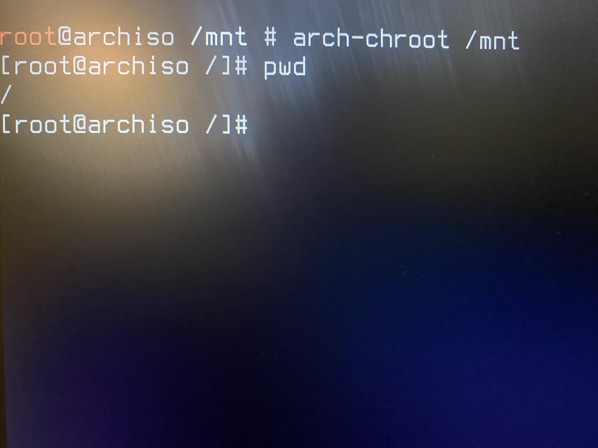

---

## 13. Configure mkinitcpio

Edit `/etc/mkinitcpio.conf` and set:

```bash
HOOKS=(base systemd autodetect modconf block sd-encrypt sd-lvm2 sd-vconsole filesystems fsck)
```

Regenerate initramfs:

```bash
mkinitcpio -P
```

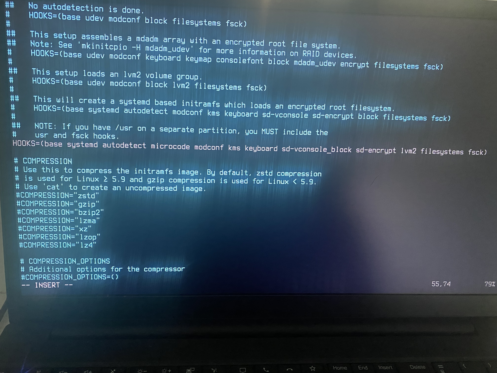

---

## 14. systemd-boot Setup

Install bootloader:

```bash
bootctl install
```

Configure `/boot/loader/loader.conf`:

```ini
default arch
timeout 3
editor no
```

Create `/boot/loader/entries/arch.conf`:

```ini
title Arch Linux
linux /vmlinuz-linux
initrd /intel-ucode.img
initrd /initramfs-linux.img
options rd.luks.name=<LUKS-UUID>=<volumegroup> root=/dev/mapper/oluwa-root rw nomodeset
```

---

## 15. Base System Finalization

Set timezone, locales, hostname, and hosts file accordingly.

---

## 16. User Setup

- Set root password.
- Create new user, add to `wheel` group.
- Enable sudo for `wheel` group in `/etc/sudoers`.

---

## 17. Storage and Boot Flow Diagram

```
+---------------------------+
|        systemd-boot       |
+-------------+-------------+
              |
              v
       Initramfs (sd-encrypt)
              |
              v
+-------------+-------------+
|     LUKS Encrypted Disk   |
| (/dev/nvme0n1p3)          |
+-------------+-------------+
              |
              v
     LVM Volume Group (oluwa)
     +-------------------+
     |  swap  (8G)       |
     |  root  (32G)      |
     |  home  (remaining)|
     +-------------------+
              |
              v
        Mounted Filesystem
          (/ on root LV)
```

---

## 18. Reboot and Post-installation

```bash
exit
umount -R /mnt
swapoff -a
reboot
```

---

*You now have a secure Arch Linux base system with full disk encryption and flexible volume management, ready for headless Kubernetes home lab deployment.*
