# Arch Linux Installation with LUKS Encryption, LVM, and systemd-boot

## Overview

This guide details the step-by-step installation of Arch Linux on a clean NVMe disk, secured with full disk encryption (LUKS), flexible partition management via LVM, and booting through systemd-boot. This setup forms a robust foundation for a secure, headless Kubernetes home lab environment.

A crucial note addresses adding the `nomodeset` kernel parameter to resolve graphics compatibility issues on certain hardware.

The installation begins by verifying ISO integrity and authenticity using GPG keys to ensure a trusted installation medium.

---

## 1. Verifying the Arch ISO

1. Download the ISO from an official Arch Linux mirror.
2. Download the matching `.sig` signature file.
3. Import the Arch Linux master signing key:

```bash
gpg --auto-key-locate clear,wkd -v --locate-external-key <KEY_ID>
```

4. Verify the ISO:

```bash
gpg --verify archlinux-2025.08.01-x86_64.iso.sig archlinux-x86_64.iso
```
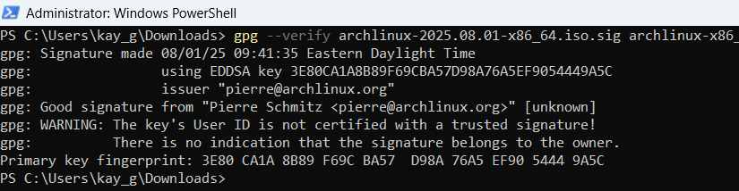
✅ Successful verification confirms the signature is valid and signed by a trusted Arch developer.

---

## 2. Creating a Bootable USB with Rufus

On Windows, use **Rufus** to flash the Arch Linux ISO onto a USB drive.

- Select **GPT partition scheme for UEFI**.

---

## 3. Handling Graphics Issues with `nomodeset`

If encountering a black screen, add `nomodeset` as a temporary kernel parameter at boot to bypass kernel mode setting.

---

## 4. BIOS/UEFI Configuration to Boot from USB

1. Enter BIOS/UEFI setup (F2, F12, Del, or Esc at startup).
2. Set USB flash drive as primary boot device.
3. Disable **Secure Boot** to allow booting unsigned OS images.
4. Save and exit.

---

## 5. Boot into Arch ISO

You should now be inside the Arch Linux live environment.

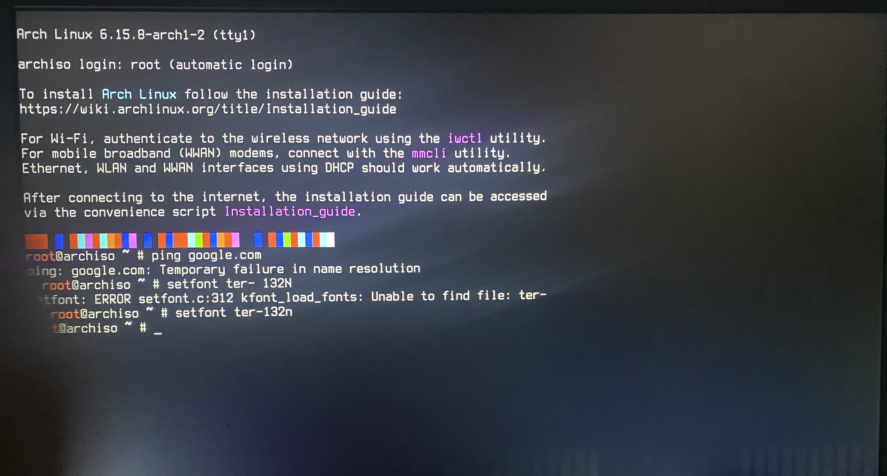 
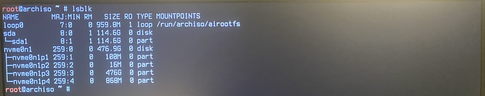

---

## 6. Wiping Disk with `sgdisk`

```bash
sudo sgdisk --zap-all /dev/nvme0n1
```

This clears old partition tables and metadata.
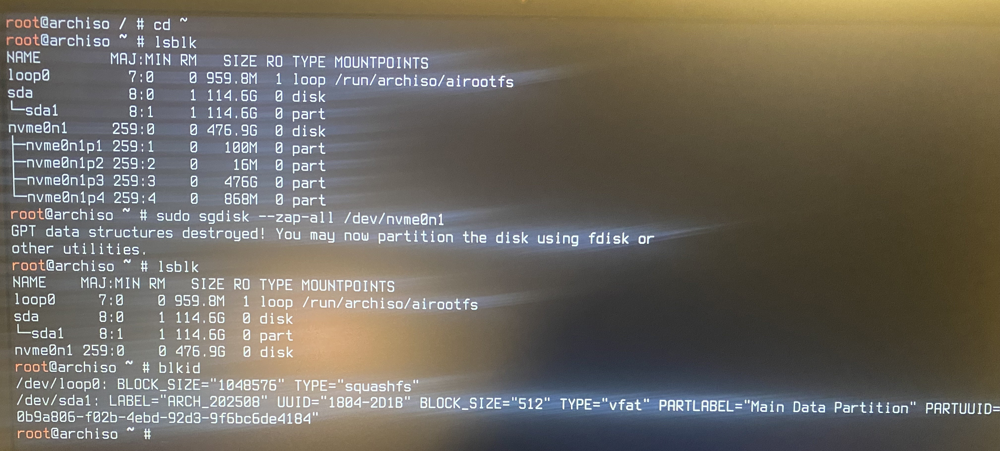

---

## 7. Disk Partitioning with fdisk

Create three partitions using the fdisk utility:

- EFI System Partition (1 GiB), type `ef00`
- (Optional) BIOS Boot Partition (1 MiB), type `ef02`
- Linux LVM Partition (remaining space), type `8e00`

This layout supports both UEFI and BIOS boot modes and prepares LVM for encryption and logical volume creation. 

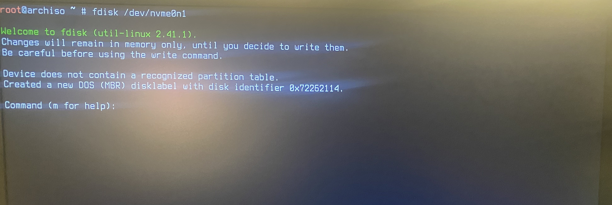 
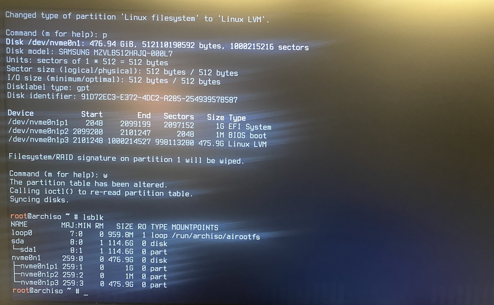

---

## 8. Encrypting LVM Partition with LUKS
Initialize encryption:

```bash
cryptsetup luksFormat /dev/nvme0n1p3
cryptsetup open /dev/nvme0n1p3 cryptlvm
```

Create LVM volume group inside encrypted container:

```bash
vgcreate <volumegroup> /dev/mapper/cryptlvm
```

> **Note:** LVM enables dynamic resizing and flexible storage management, while LUKS ensures full-disk encryption, protecting data at rest against unauthorized access. 

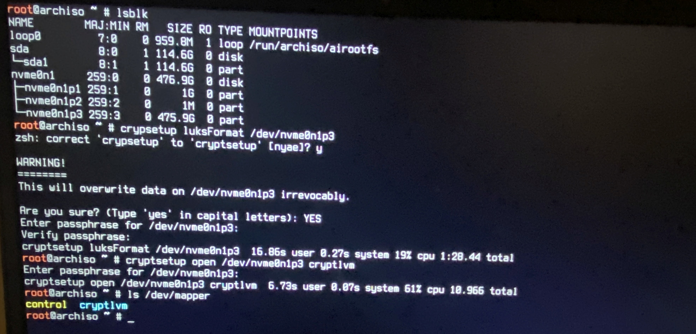

---

## 9. Creating Logical Volumes

```bash
lvcreate -L 8G <volumegroup> -n swap
lvcreate -L 32G <volumegroup> -n root
lvcreate -l 100%FREE <volumegroup> -n home
```
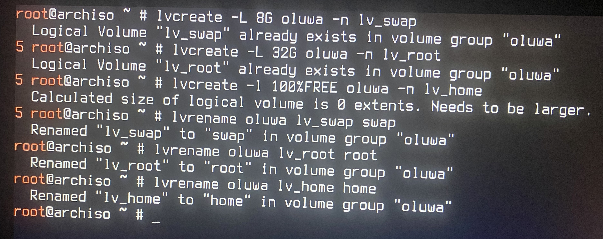
---

## 10. Formatting and Mounting

```bash
mkfs.fat -F32 /dev/nvme0n1p1
mkfs.ext4 /dev/<volumegroup>/root
mkfs.ext4 /dev/<volumegroup>/home
mkswap /dev/<volumegroup>/swap
```

> ⚠️ **Mounting Order Matters**
> 
> Always mount the **root (`/`) filesystem first**. Other filesystems like `/boot`, `/home`, or `/var` must be mounted *inside* the root hierarchy, so they depend on it being mounted.  
> 
> Correct sequence:
> 1. Mount root → `/mnt`
> 2. Mount `/boot`, `/home`, etc. → inside `/mnt`
> 3. Enable swap anytime (not tied to the hierarchy).

Mount:

```bash
mount /dev/<volumegroup>/root /mnt
mkdir /mnt/boot
mount /dev/nvme0n1p1 /mnt/boot
mkdir /mnt/home
mount /dev/<volumegroup>/home /mnt/home
swapon /dev/<volumegroup>/swap
```
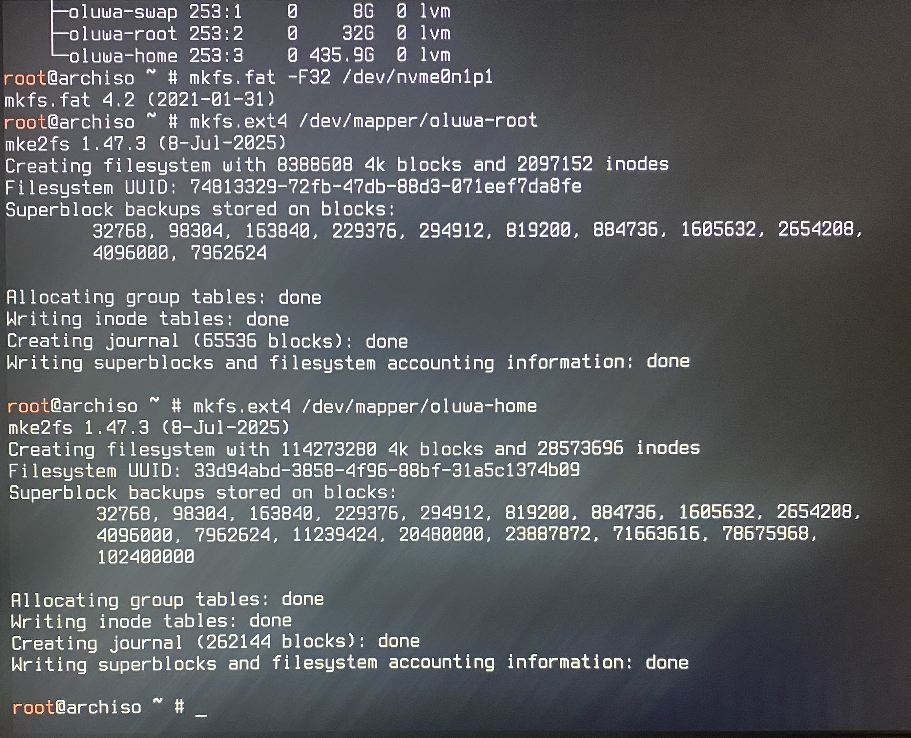
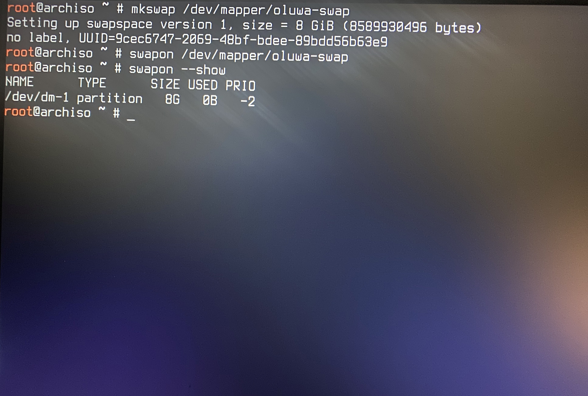 
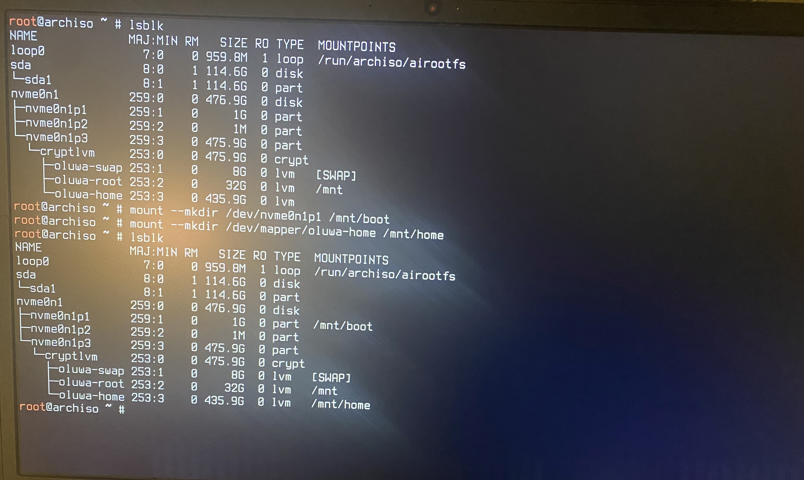 
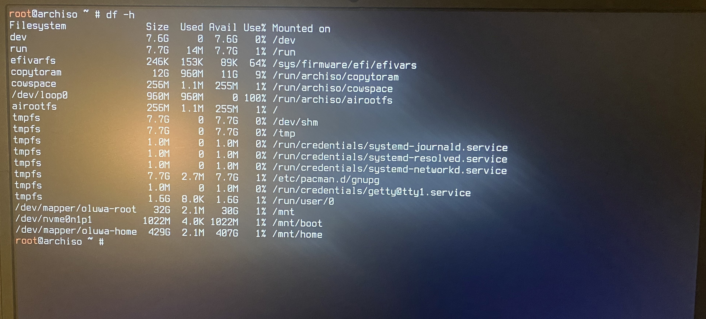

---

## 11. Installing Base System

```bash
pacstrap /mnt base linux linux-firmware lvm2 systemd-boot
genfstab -U /mnt >> /mnt/etc/fstab
```
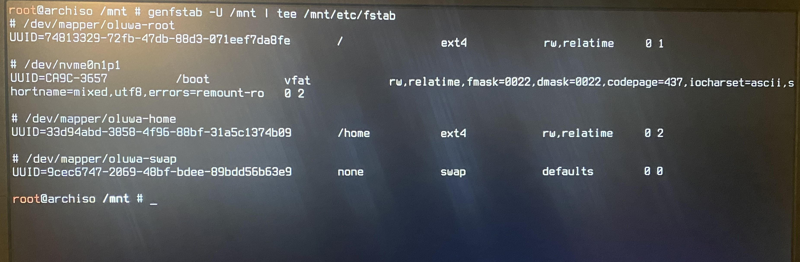
---

## 12. System Configuration in chroot

Set timezone, locales, hostname, and networking:

```bash
arch-chroot /mnt
ln -sf /usr/share/zoneinfo/Region/City /etc/localtime
hwclock --systohc
echo "en_US.UTF-8 UTF-8" >> /etc/locale.gen
locale-gen
echo "archhost" > /etc/hostname
```

Enable networking:

```bash
systemctl enable systemd-networkd
systemctl enable systemd-resolved
```
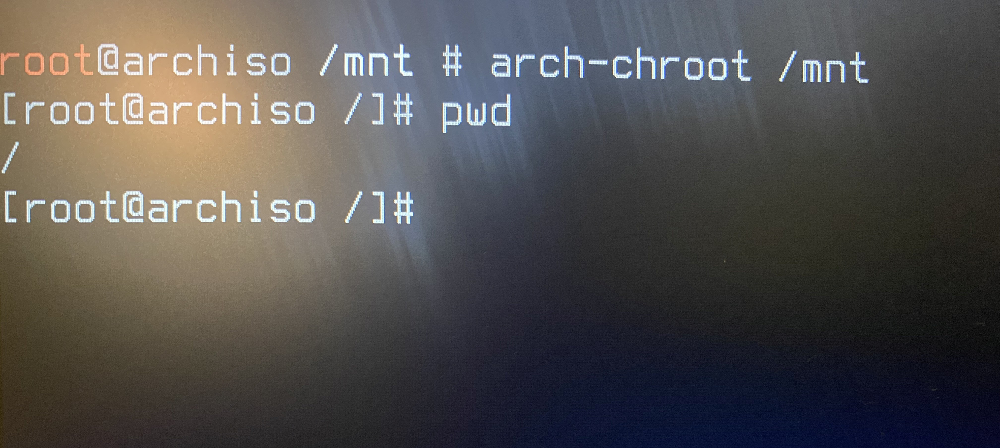
---

## 13. Configure mkinitcpio

Edit `/etc/mkinitcpio.conf`:

```bash
HOOKS=(base systemd autodetect modconf block sd-encrypt sd-lvm2 sd-vconsole filesystems fsck)
```

Rebuild initramfs:

```bash
mkinitcpio -P
```

---

## 14. systemd-boot Setup

Install bootloader:

```bash
bootctl install
```

Configure `/boot/loader/loader.conf`:

```ini
default arch
timeout 3
editor no
```

Create `/boot/loader/entries/arch.conf`:

```ini
title Arch Linux
linux /vmlinuz-linux
initrd /intel-ucode.img
initrd /initramfs-linux.img
options rd.luks.name=<LUKS-UUID>=<volumegroup> root=/dev/mapper/<>-root rw nomodeset
```

---

## 15. User Setup

```bash
passwd
useradd -m -G wheel -s /bin/bash <user>
passwd <user>
EDITOR=vim visudo
```

Uncomment:

```
%wheel ALL=(ALL:ALL) ALL
```

---

## 16. Storage and Boot Flow Diagram
```

+---------------------------+
|        systemd-boot       |
+-------------+-------------+
              |
              v
       Initramfs (sd-encrypt)
              |
              v
+-------------+-------------+
|     LUKS Encrypted Disk   |
| (/dev/nvme0n1p3)          |
+-------------+-------------+
              |
              v
     LVM Volume Group (volumegroup)
     +-------------------+
     |  swap  (8G)       |
     |  root  (32G)      |
     |  home  (remaining)|
     +-------------------+
              |
              v
        Mounted Filesystem
          (/ on root LV)-- home (remaining)
```
## Why the Disk Unlocks Before Boot

- The root partition is LUKS encrypted.
- `/boot` is unencrypted so the bootloader can start.
- `sd-encrypt` hook in initramfs prompts for passphrase before mounting root.
- Without passphrase, system cannot boot → ensuring strong security.
---

## 17. Reboot

```bash
exit
umount -R /mnt
swapoff -a
reboot
```

---

## 18. Scrubbing EXIF Metadata

Photos contain sensitive metadata like GPS coordinates and device info.

Install `exiftool`:

```bash
pacman -S exiftool
```

Scrub metadata:

```bash
exiftool -all= *.jpg
```

Optional Git pre-commit hook to auto-strip metadata:

```bash
#!/bin/sh
exiftool -all= "$@"
```

---
✅ You now have a secure Arch Linux base system with full disk encryption, flexible volume management, and metadata hygiene — ready for Kubernetes homelab deployment!